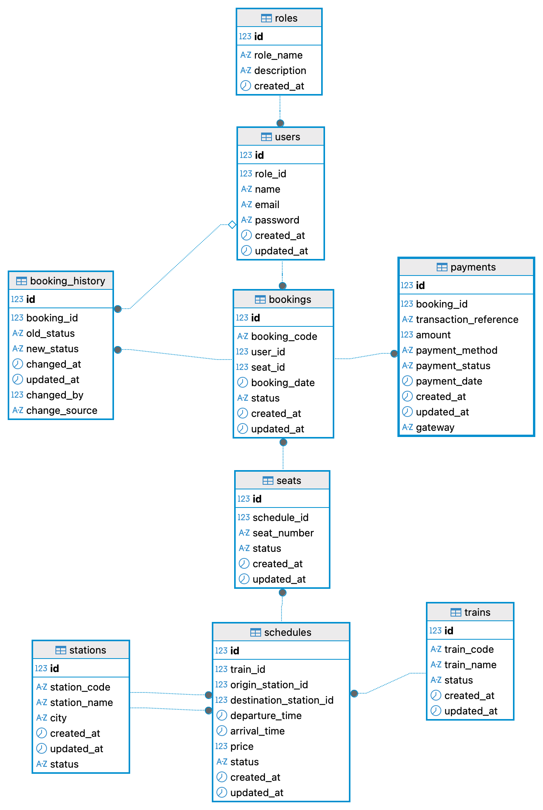

# Train Ticket Reservation API

A RESTful backend API for a Train Ticket Reservation System built with **Spring Boot** and **PostgreSQL**.

This project was developed as a **QA Automation System Under Test (SUT)** to demonstrate backend API development, API testing, and automation practices using real-world business scenarios.

---

## Project Status

**Current Version:** V1

This project is actively maintained. Future releases will expand both the backend capabilities and automation coverage as new business modules are implemented.

---

# Project Overview

The application provides REST APIs for managing train ticket reservation master data including:

- Authentication (JWT)
- Train Management
- Station Management
- Schedule Management

The project focuses on implementing clean architecture, business validation, security, and REST API best practices to serve as a realistic backend for API automation testing.

---

# Tech Stack

| Technology | Version |
|------------|----------|
| Java | 21 |
| Spring Boot | 3.x |
| Spring Security | JWT |
| Spring Data JPA | Hibernate |
| PostgreSQL | 14 |
| Maven | Latest |
| Lombok | ✓ |
| Postman | API Testing |
| Git | Version Control |

---

# Architecture

```
Client
   │
   ▼
Controller
   │
   ▼
Service
   │
   ▼
Repository
   │
   ▼
PostgreSQL
```

Project follows a layered architecture:

- Controller Layer
- Service Layer
- Repository Layer
- DTO Layer
- Exception Handling
- Security Layer

---

# Project Structure

```
src
└── main
    ├── controller
    ├── service
    ├── repository
    ├── entity
    ├── dto
    ├── security
    ├── exception
    └── config
└── resources
```

---

# Authentication

JWT Authentication is implemented.

Available endpoints:

| Method    | Endpoint           |
|-----------|--------------------|
| POST      | /api/auth/register |
| POST      | /api/auth/login    |

Roles:

- ADMIN
- USER

Authorization:

| Module | ADMIN | USER |
|----------|:----:|:---:|
| GET | ✅ | ✅ |
| POST | ✅ | ❌ |
| PUT | ✅ | ❌ |
| PATCH | ✅ | ❌ |
| DELETE | ✅ | ❌ |

---

# Modules

## Authentication

- Register
- Login
- JWT Authentication

---

## Train Management

Implemented APIs

- Get All Trains
- Get Train By ID
- Create Train
- Update Train
- Update Train Status
- Delete Train

Business Rules

- Train Code must be unique 
- Train Code is immutable
- Default status ACTIVE
- Status only ACTIVE / INACTIVE
- Trim whitespace before validation
- Duplicate validation
- Role-based authorization

---

## Station Management

Implemented APIs

- Get All Stations
- Get Station By ID
- Create Station
- Update Station
- Update Station Status
- Delete Station

Business Rules

- Station Code must be unique
- Station Code is immutable
- Default status ACTIVE
- Status only ACTIVE / INACTIVE
- Trim whitespace before validation
- Duplicate validation

---

## Schedule Management

Implemented APIs

- Get All Schedules
- Get Schedule By ID
- Create Schedule
- Update Schedule
- Update Schedule Status
- Delete Schedule

Business Rules

- Train must exist
- Origin station must exist
- Destination station must exist
- Train must be ACTIVE
- Origin station must be ACTIVE
- Destination station must be ACTIVE
- Origin and destination cannot be the same
- Arrival time must be after departure time
- Duplicate schedule validation
- Response DTO implementation

---

# HTTP Status Codes

| Code | Description |
|------|-------------|
| 200 | OK |
| 201 | Created |
| 204 | No Content |
| 400 | Bad Request |
| 401 | Unauthorized |
| 403 | Forbidden |
| 404 | Resource Not Found |
| 409 | Conflict |
| 500 | Internal Server Error |

---

# ✅ Validation

Implemented validations include:

- Required field validation
- Duplicate validation
- Business validation
- Resource existence validation
- Status validation
- JWT authorization
- Role validation

---

## 🗄 Database

### Implemented (V1)

- Users
- Trains
- Stations
- Schedules

### Planned (V2)

- Seats
- Bookings
- Payments
- Booking History

---

## 🗄 Database Design

The following ERD represents the complete database design of the project.

> **Note:** Version 1 currently implements Roles, Users, Trains, Stations, and Schedules. The remaining entities are planned for future development.



---


## 🚀 Roadmap

### Version 2

- Seat management
- Booking module
- Payment module
- Booking history
- Booking cancellation
- Enhanced validation
- Swagger/OpenAPI

---

# 🚀 Running the Project

## Clone Repository

```bash
git clone https://github.com/hermansiswanto/train-ticket-api.git
```

---

## Configure Database

Update:

```
application.yml
```

PostgreSQL credentials.

---

## Run

```bash
mvn spring-boot:run
```

---

Application will start at

```
http://localhost:8080
```

---

# 🧪 API Testing

API can be tested using:

- Postman

Postman Collection will be provided in the `/Postman` directory.

---

# 📈 Planned QA Automation

The project is designed as a System Under Test (SUT) for API automation.

Upcoming implementations:

- Postman Collection
- Pytest API Automation
- HTML Test Report
- GitHub Actions CI/CD
- API Test Documentation

---

# 🎯 Project Goals

This project was built to demonstrate:

- REST API development
- Spring Boot backend architecture
- JWT Authentication
- Business validation
- Exception handling
- API testing
- QA Automation practices

---

# 👨‍💻 Author

Herman Siswanto

QA Engineer | Aspiring QA Automation Engineer